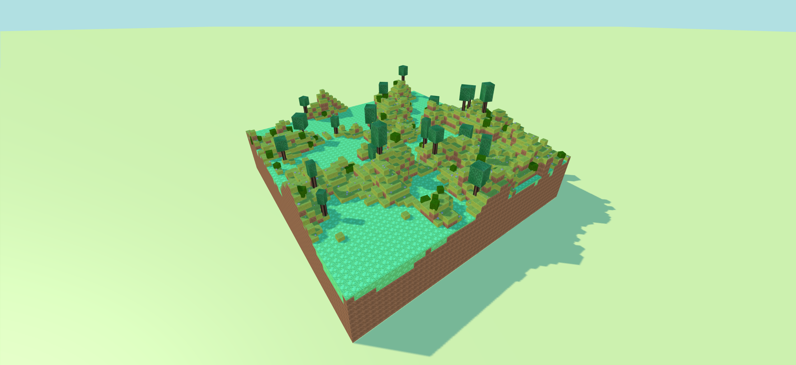
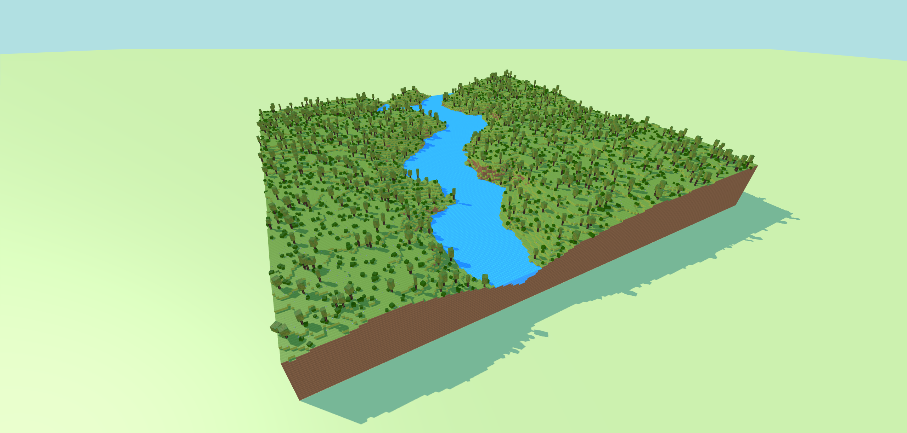
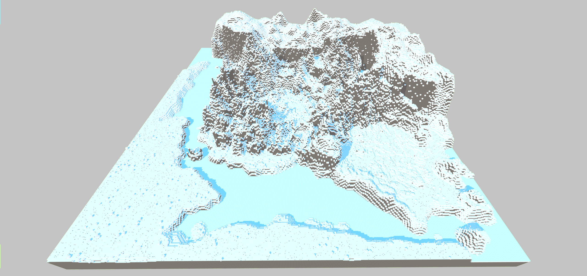
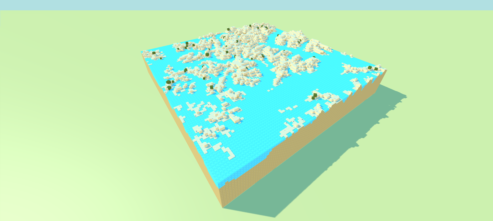
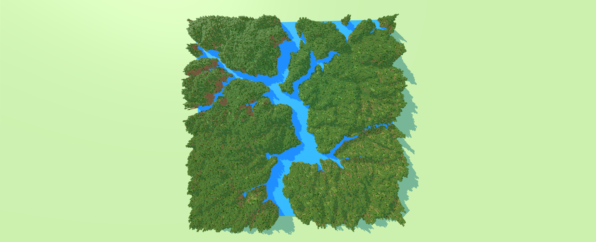
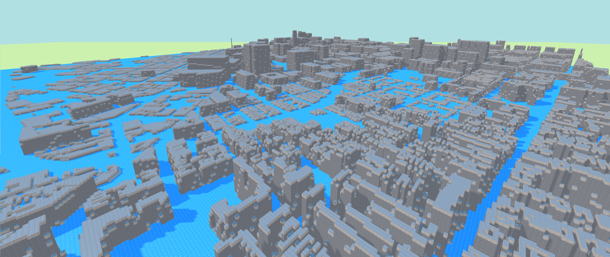
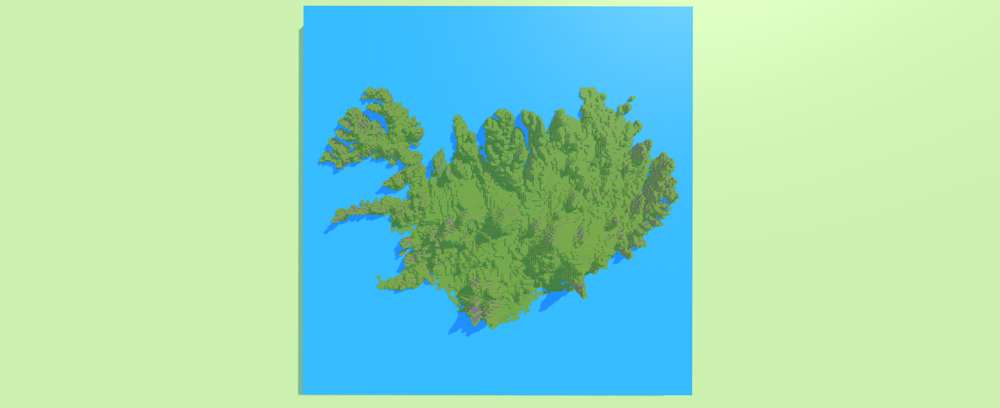
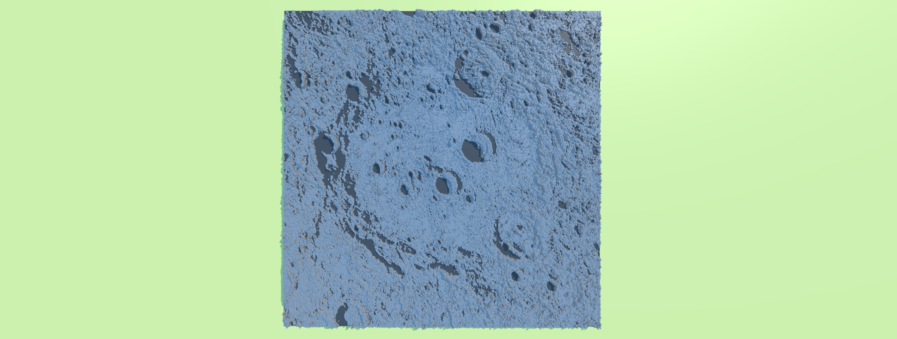
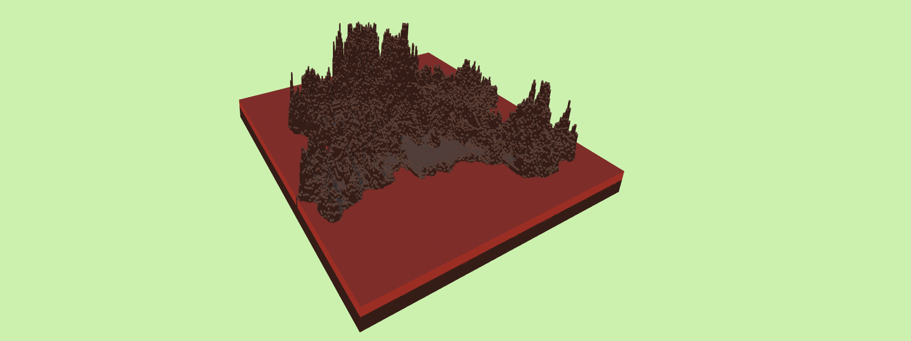
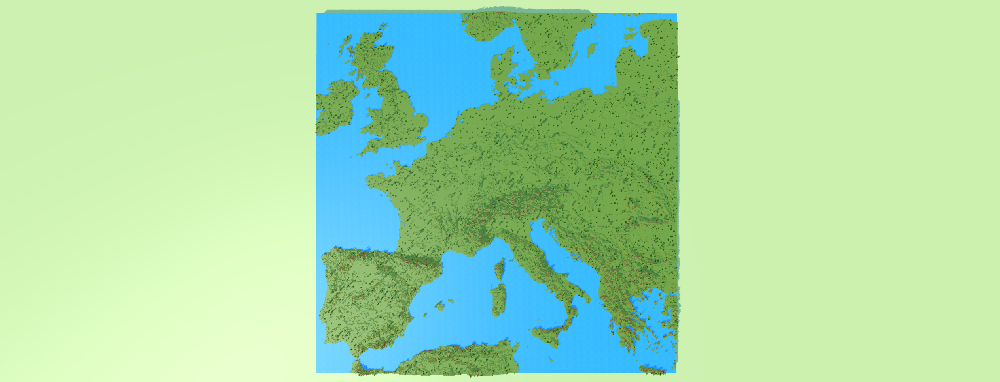

# Voxel Terrain Generation

## Descrizione

Il progetto propone un algoritmo di generazione di terreni in stile voxel. L'algoritmo è in grado di creare un terreno partendo da un'immagine heightmap presa come input che viene interpretata analizzando la gradazione di grigio di ciascun pixel. La gradazione di grigio misurata andrà ad influenzare l'altezza del terreno finale nella posizione corrispondente al pixel analizzato.

La Mesh del terreno viene generata istanziando il numero minimo di triangoli possibili. Le facce di cubo che verrebbero posizionate in zone non osservabili (utilizzando un approccio naive) non vengono istanziate, annullando così l'overhead di poligoni non necessari.

Il risultato finale non dipende solo dall'immagine utilizzata come input ma anche da una serie di parametri con cui è possibile configurare la generazione. Segue una lista delle features e dei relativi parametri configurabili.

- Conformazione del terreno:
  - altezza_max_terreno: permette di controllare l'altezza massima del terreno. Questo parametro normalizza i valori ottenuti analizzando l'heightmap (compresi tra 0-255) in un range desiderato, permettendo così di controllare quanto sono accentuati i dislivelli del terreno.
  - wireframe_view: è possibile generare il terreno in modalità wireframe.possibile cambiarne le texture per ottenere scenari alternativi.
- Vegetazione: L'algoritmo fornisce un sistema che permette di popolare il terreno con della vegetazione.
  - Sono presenti tre tipologie di entità generabili: alberi,cespugli e rocce.
  - è possibile scegliere la densità (0-100%) di questi oggetti sul terreno.
  - gli oggetti vengono generati in posizioni randomiche del terreno
  - gli oggetti vengono generati con scalature e rotazioni randomiche in modo da variarne l'aspetto.
- Acqua: L'algoritmo permette di creare delle superfici d'acqua.
  - L'acqua viene controllata dal parametro sea_level che identifica l'altezza dell'acqua.
- Textures: L'algoritmo permette di specificare quali texture utilizzare per il terreno,alberi,acqua etc. etc. per ottenere scenari alternativi.
- GUI: Le scene su cui viene generato il terreno sono forniti di una GUI che permette di visualizzare alcune informazioni relative al terreno generato, tra cui numero di poligoni e di cubi, l'heightmap utilizzata, il tempo di generazione etc.

### Scena rappresentativa del progetto:

Il progetto viene fornito con una scena principale che permette di vedere tutte le features all'azione. Il file ScenaPrincipale rappresenta un ipotetico risultato ottenibile tramite l'algoritmo. Nella ScenaPrincipale è stato inoltre inserito manualmente un mulino animato al centro della scena che rappresenta uno degli ipotetici utilizzi dei terreni generati.

Segue a fine README una lista di screenshoot dimostrativi di alcuni parametri dell'algoritmo, a sua volta seguita da una lista di scenari realizzati mediante quest'ultimo (i file sono presenti nel progetto e visualizzabili in real-time sul proprio browser. NB: Alcuni terreni potrebbero risultare molto pesanti per hardware non performante!).

## Idee non implementate

- GUI che permetta di modificare i parametri di generazione del terreno e di rieseguire la generazione del terreno, così da evitare di dover modificare il codice ogni volta e permette ad un utente di interagire con la scena.
- Shaders acqua.
- Più varianti che popolano la scena.
- Possibilità di switchare tra vista wireframe on/off in real-time;
- Possibilità di switchare tra vista ortografica e prospettica in real-time;
- Ambient Occlusion sul terreno.
- Nuvole animate sopra la scena la cui generazione è controllata da alcuni parametri (ad es: quantità,opacità,velocità,altitudine).

## Tools utilizzati

## Screenshoot dimostrativi

## Screenshoot scenari realizzati

