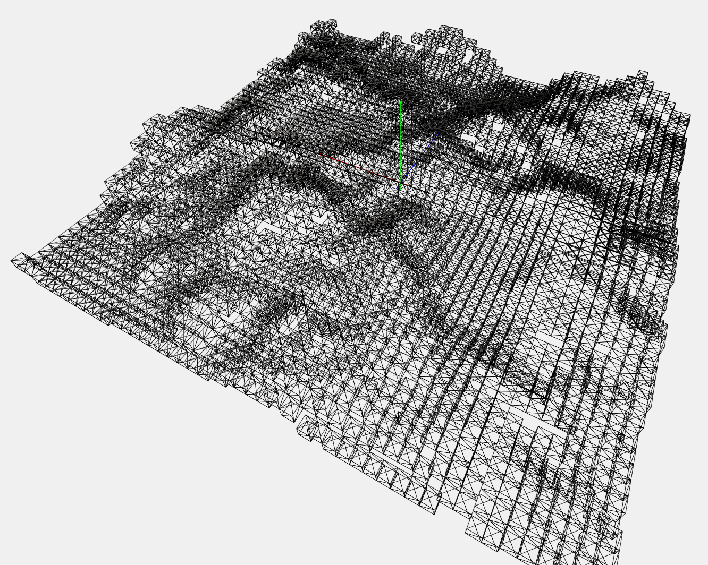
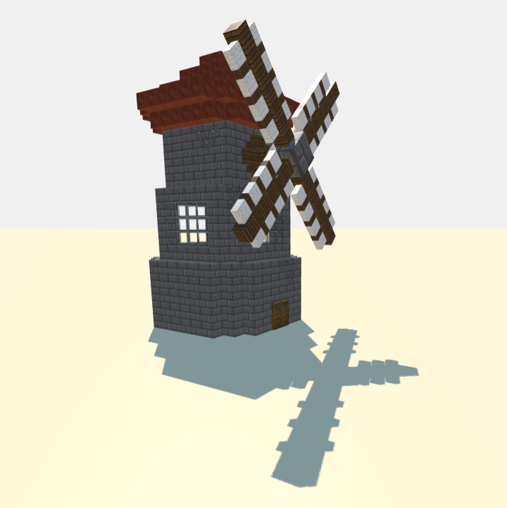
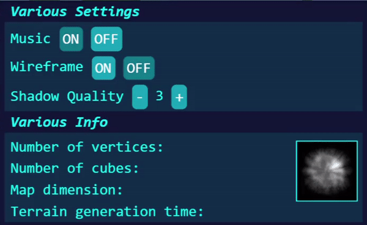
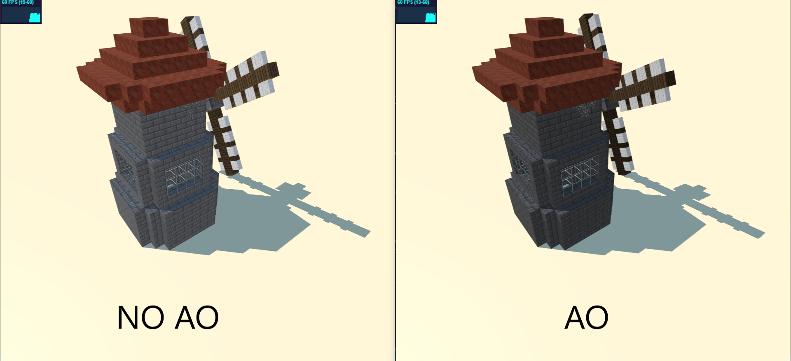

# Interactive 3D Graphics - Progetto

## 28 Ottobre

### Mansi
- Visualizzazione della consegna
- Visualizzazione del codice e piccoli test
- Sperimentazione del codice *heightmap* - implementazione di un primo prototipo di algoritmo di generazione del terreno

    Primo Prototipo
    

    Primo Prototipo (vista Wireframe)
    

    Heightmap usata
    

###
- Refactoring del codice
  - creazioni funzioni per inizializzare camera
  - scena
  - renderer
  - lightsystem

- Commit su GIT

---
## 29 Ottobre

### Mansi
- Ulteriori sperimentazioni con l’algoritmo di generazione del terreno
  - sperimentazione e analisi del primo problema riscontrato: il terreno non risulta uniforme perchè ci sono dei "fori" nei cambi di altezza troppo bruschi, da risolvere

    Esempio problema
  

    Heightmap utilizzata, creata al fine di accentuare il problema riscontrato
  
    

  - Prima sperimentazione che tenta di risolvere il problema, soluzione efficacie ma poco efficiente. Alcuni cubi mancanti vengono inseriti più volte portando ad un overhead nella fase geometry della gpu-pipeline. 

    Esempio del terreno "fixato".
    In giallo i cubi aggiunti successivamente alla prima fase di generazione del terreno
    

  - Seconda Implementazione che risolve senza overhead la problematica dei dislivelli elevati
    

- Pulizia del codice
- Commit su GIT
- Altri problemi riscontrati: pesante impatto sulle performance da parte del sistema di ombre e illuminazione, artefatti grafici sui “bordi dei cubi”. 40-50 fps su una RTX 2070 – i7 9700K.

  esempio di artefatti grafici sui bordi dei cubi
    

---
## 30 Ottobre

### Meeting Gruppo

Progettazione della scena di base e suddivisione dei compiti

Durante i primi giorni di lavoro i compiti sono stati suddivisi in questo modo:
- Relazione: Passabi
- Generazione del terreno: Mansi
- Animazioni, modellazione: Passabi
- LightSystem & Visuals: TODO
- Spawning di oggetti nella scena: TODO

Scena di base (minima da soddisfare i requisiti della consegna)
- Generazione del terreno con:
  - Terreno sui blocchi della superficie;
  - Roccia sui blocchi sottostanti (visibili dall’esterno)
  - Erba, cespugli e alberi posizionati randomicamente sulla superficie:
    - con animazione
    - interattività con la luce (ombre)
  - Edificio in centro alla scena
    - Con animazione 
  - Animazione della telecamera

### Mansi

- Test con heightmap più complessa -> 100x100=10K cubi = 120K triangoli
  - framerate inaccettabile (10-15 su Intel UHD 620); bisogna valutare possibili ottimizzazioni.
  - Usare dei cubi non è per niente efficiente, la maggior parte delle facce sono inutili, sono nascoste e potrebbero benissimo non essere renderizzate al fine di aumentare di molto le performance
    

- Obiettivi del giorno: ottimizzazione della generazione del terreno, lato geometry.
  - Soluzione: inizialmente con una heightmap di 100x100 istanziavamo 10K blocchi nella scena, portando ad un elevato overhead nella gestione di un alto numero di mesh. La soluzione attuata unisce i mesh di tutti i cubi in un unico mesh. Il numero di triangoli non cambia, ma WebGl si trova a lavorare con un unico mesh (frutto del merge degli altri).
  - Possibili problemi: Ora abbiamo un unico mesh, non possiamo applicare materiali diversi… Si possono applicare diverse texture a diverse porzioni del mesh? Da sperimentare e verificare se la soluzione utilizzata è valida.
  - Altre considerazioni: L’implementazione più corretta nella generazione del terreno non dovrebbe utilizzare dei cubi ma delle facce, l’attuale implementazione.

    *Le due immagini riportano le differenze di framerate ottenuto, senza variare il risultato finale:* 
    TEST ESEGUITO SU GPU INTEGRATA INTEL UHD620 (heightmap 100x100):
    

- Settato il renderer in high performance.
- Successive modifiche: I cubi in superficie (erba) vengono mergati in un unico mesh. Allo stesso modo, quelli aggiunti successivamente per coprire i “buchi” vengono mergati in unico mesh “terra”.

  Primi test con le texture del terreno:
  

- Vari test di performance su UHD620, Nvidia 940MX, RTX 2070

### Passabi

- Prime prove con ThreeJS Editor
  - Creazione gruppi (insieme di più forme)
  - Aggiunta colore
  - Aggiunta texture
  - Trasformazioni

- Modellate le pale del mulino
  - Aggiunta texture
  - Aggiunta rotazione
  - Aggiunta ombre
  - Test su starting code with lights

- Modellata l’erba
  - Ho usato 4 piani incrociati
  - Risolto problema trasparenza non completa (usando test z-alpha)
  - Problema ombra da risolvere

- Inizio modellazione struttura del mulino

---
## 31 Ottobre

### Mansi
**Obiettivi del giorno**: refactoring e pulizia del codice; creazione di una piccola roadmap per organizzare il lavoro dei giorni successivi. 
- Ordinamento repository.
- Refactoring codice generazione terreno + commento del codice.
- Fixing normalizzazione dell’altezza (massimo numero di layer voluti)
- Fixed: I cubi vengono ora automaticamente posizionati al giusto offset dal centro della scena in modo tale che il terreno finale sia perfettamente centrato con (0,0,0).
- Fixed: Le texture sui cubi risultavano con i colori sfalsati -> Bisogna settare il material di colore bianco.
- Creazione di una piccola roadmap/lista di obbiettivi/features:

| n° | Features TODO List | Priorita' |
| :---        |    :----:   |          ---: |
| 1 | Ideazione e implementazione di un sistema di spawning randomico della vegetazione nel terreno della scena. Idee: parametro: densità vegetazione. | Alta |
| 2 | Ottimizzazione complessità del terreno (dal punto di vista geometry): Implementare l’approccio con l’uso delle facce e non dei cubi (rimozione dell’overhead di facce non visualizzate e pertanto inutili). | Media |
| 3 | Ristrutturazione del codice, inserimento di variabili (in futuro modificabili via interfaccia) che permettano di configurare con flessibilità i parametri di generazione del terreno. Es: scelta texture_heightmap, n° di layer, texture per i blocchi superficiali e non superficiali, ... | Media |
| 4 | Idea: Aggiunta di un sistema di generazione di superfici d’acqua. | Bassa |
| 5 | Idea: Aggiunta di un piano “infinito” di altezza 0 su cui “appoggia” il terreno. | Bassa |
| 6 | Ottimizzazione velocità di generazione del terreno. *Come?* | Bassa |
| 7 | La telecamera si posiziona automaticamente in una posizione coerente in base alle dimensioni del terreno generato (si adatta alle varie dimensioni). | Bassa |

- Ideazione algoritmo di spawning randomico della vegetazione.

---
## 1 Novembre

### Mansi
**Obiettivi del giorno**: Lavorare sull’implementazione dell’algoritmo di generazione della vegetazione.

- Implementazione dell’algoritmo di spawning randomico di vegetazione nel terreno precedentemente generato. L’algoritmo prende in input un valore “grass_density” che va da 0 a 100, ad esempio: con un valore di 25 vengono scelti randomicamente 25% dei cubi della superficie su cui verrà poi istanziato un modello di vegetazione.
  
  Nell’esempio: Circa 6000 modelli di erba istanziati
  

- Problema riscontrato da fixare: L’algoritmo attualmente importa tramite ObjectLoader il file json (in questo esempio il modello dell’erba) e poi si occupa di istanziarlo nel terreno: Questo causa, come riscontrato precedentemente un overhead nella gestione di un elevato numero di oggetti nella scena, abbattendo il framerate drasticamente (15 FPS su una RTX 2070). Precedentemente, con i cubi del terreno il problema è stato risolto eseguendo il merge dei mesh di ciascun cubo in un'unica entità. È necessario effettuare la stessa operazione con i modelli di vegetazione? Come? Effettuare ricerche.
- Implementazione della feature n° 2 -> Ottimizzazione della complessità del terreno: Implementata la generazione che fa uso di facce e non di cubi. L’overhead di facce istanziate e renderizzate inutilmente è stato rimosso causando un enorme vantaggio in termini di performance. Precedentemente si notavano cali di framerate con terreni da 250x250. Con il nuovo approccio è possibile gestire e visualizzare su schermo terreni generati da immagini superiori a 500x500.

  Heightmap 500x500
  

  Heightmap: 750x750
  Visione wireframe: è possibile notare come non siano più presenti le facce “nascoste” che precedentemente venivano inserite nella scena inutilmente.
  

- Commit su GIT delle modifiche

### Passabi
**Obiettivi del giorno**: finire il modello del mulino, implementazione musica, ricerche sulle GUI, relazione in linguaggio markdown ed eventuali altri modelli

- Refactoring codice
  - si erano create delle inconsistenze sul ramo master di GIT, risolte
  - nuova organizzazione cartelle per evitare che il problema si ripresenti

- Aggiunta musica di sottofondo alla scena
  - per ora, si puo' disattivare premendo "s" (= spegni) e riattivare premendo "m" (= musica)
  - TO DO: implementare queste funzioni con la GUI (priorita' media)

- Scrittura portfolio in linguaggio MarkDown
  - TO DO: finire di inserire le immagini nella directory project_report/img

- Creato modello fungo rosso e grigio + test
  - NB: per le texture abbiamo deciso di usare delle skin gratuite usate per delle mod di MineCraft 
  - TODO: la parte trasparente non dovrebbe fare ombra --> da fixare

- Riscontrato problema sulle pale del mulino
  - Se viene chiamata in Update la rotazione prima che il modello sia caricato al 100% si generano degli errori
  - Risolto con un controllo sul tipo di oggetto prima di effettuare la rotazione

- Completato il modello del mulino

  

- Commit su Git
  
---
## 2 Novembre

### Mansi

- Obiettivi del giorno: analisi del codice, refactoring & ottimizzazione.

  - aggiunta misurazione tempo di generazione del terreno.
  - ottimizzazione fase di generazione del terreno:
    - tramite piccoli accorgimenti sul codice è stato possibile velocizzare la fase di generazione del terreno. Per testare il risultato è stata utilizzata una heightmap di 750x750 la quale è stata generata prima in 14555ms e poi, con le ottimizzazioni effettuate in 8440ms portando a un miglioramento circa pari al 42%.
    Le misurazioni sono frutto della media di diverse misurazioni.
  - Eseguito test di performance dopo l'ottimizzazione del codice: utilizzando un'img in input 1250x1250 il codice è riuscito a generare e visualizzare su schermo in 30.5sec un terreno da 1562500 blocchi superficiali (esclusi quelli delle penedenze) portando la CPU (i7 9700K) costantemente al 100%, un utilizzo della GPU di circa 40% (RTX 2070), e un utilizzo di circa 9GB di memoria primaria.
  - I 4 lati agli estremi del terreno ora non sono più "vuoti" ma viene generata una parete in modo da rendere più piacevole la visione del terreno da distanze elevate; è stato inoltre aggiunto un piano su cui poggia il terreno.
  - è stato fixato un problema che generava erroneamente le "pareti" nei blocchi ai bordi del terreno.

Aggiornata la ROADMAP:

| n° | Features TODO List | Priorita' |
| :---        |    :----:   |          ---: |
| 1 | Fixing dell'algoritmo di generazione/spawning della vegetazione nel terreno: Capire come mergare i mesh e ottimizzare la presenta di un elevato numero di oggetti! | Alta |
| 2 | Idea: Aggiunta di un sistema di generazione di superfici d’acqua. | Bassa |
| 3 | La telecamera si posiziona automaticamente in una posizione coerente in base alle dimensioni del terreno generato (si adatta alle varie dimensioni). | Bassa |

### Passabi

- Creato branch per sperimentare con luci e ombre
- Riscontrato problema quando vengono cambiate le impostazioni usando la funzione *onDocumentKeyDown*
  - Soluzione: implementare una GUI --> primi test con div HTML e CSS

- Implementazione GUI
  - CSS simile al contatore FPS
  - Implementato il controllo musica ON/OFF
  - Implementata la gestione della qualita della luce direzionale
  - Implementate informazioni sulla mappa e visualizzazione di Heightmap usata

    
  
- Modellazione alberi
  - modello albero di mele

    

- Creato branch per la modifica di alcuni modelli
  - perfezionato albero di mele (aggiunta trasparenza)
  - modificato il tetto del mulino
  - sistemate alcune ombre non corrette del mulino
  - aggiunte ragnatele al mulino
  - aggiunto albero tipo betulla (versione normale)
  - aggiunto albero tipo betulla (versione autunno)

  

- Idea: personaggio incorporeo (fantastimo) che fluttua sulla mappa e rende possibile visitare il mondo

- Idea: aggiungere occlusione ambientale
  - ricerche
  - primi test su 2 cubi (uno con AO, uno senza)
  - aggiunta dell'AO sul mulino
  - vari test sulle altre impostazioni disponibili in three js editor - fallimentari, nulla di utile al momento

  

## 3 Novembre

### Mansi:

- rilettura e piccole sistemazioni del codice.
- sistemazione di alcune texture.
- alcune sperimentazioni con l'ottimizzazione degli oggetti caricati tramite ObjectLoader senza alcun risultato.
- visione della lezione sugli shaders.

## 4 Novembre

### Mansi & Passabì:

- Colloquio con il professore a fine lezione relativa alla problematica riscontrata (basse performance con un'alto numero di istanze di oggeti caricati tramite Objectloader).
  - Soluzioni possibili:
    - Eseguire il merge dei vari mesh come effettuato con i cubi(facce) (il mesh del terreno).
    - Condividere geometria e materiale per ciascuna istanza dell'oggeto, al fine di ridurre drasticamente i cambi di contesto effettuati dalla gpu. (in astratto "passare da n oggetti diversi a n istanze di un solo oggetto").

### Mansi:

- Rilettura del codice & aggiornamento del report.
- Aggiornamento della ROADMAP:

| n° | Features TODO List | Priorita' |
| :---        |    :----:   |          ---: |
| 1 | Fixing dell'algoritmo di generazione/spawning della vegetazione nel terreno: Sperimentare le soluzioni proposte precedentemente. | Alta |
| 2 | Introdurre l'entità cespuglio da posizionare randomicamente nella scena (idea: parametro dimensione che varia randomicamente) | Alta |
| 3 | Commentare e fare il refactoring del codice prima della consegna | Obbligatoria |
| 4 | Creazione della scena finale da presentare come lavoro concluso | Obbligatoria | 
| 5 | Valutare come sostituire l'erba billboard non consentita dal progetto in quanto "non fatta a cubi" | Bassa |
| 6 | Implementazione dell'ambient occlusion | Bassa |
| 7 | Aggiunta di qualche shader? sperimentare ed eventualemte aggiungere dove sensato. | Bassa |
| 8 | Idea: Aggiunta di un sistema di generazione di superfici d’acqua. | Bassa |
| 9 | La telecamera si posiziona automaticamente in una posizione coerente in base alle dimensioni del terreno generato (si adatta alle varie dimensioni). | Bassa |

### Passabi

- Fix minori codice
- Modifiche alla GUI per quanto riguarda la gestione delle ombre

## 5 Novembre

### Mansi:

- Introdotta l'entità cespuglio e completata l'implementazione della sua generazione e posizionamento randomico nel terreno. (Non si è verificato il problema di performance, i cespugli vengono mergiati in un unico mesh alla fine della loro generazione.)
- Pulizia e Commento del codice.
- screenshots, aggiornamento report.md, commit su git.

### Passabi

- Aggiunte immagini al log markdown
- Spostamento log dal file personale al file condiviso

## 6 Novembre

### Mansi & Passabì:

- Creazione prima scena
  - implementazione GUI
  - aggiunta mulino
  - aggiunti cespugli
  - aggiunti sassi (con fix posizione)
  - modificato il colore del cielo
  - modificato il colore del piano su cui appoggia la scena

### Passabi
- Modifica telecamera: non può più andare sotto il livello del terreno
- Modificate texture scena 1 (sostituite con texture realistiche - no cp)
  - Modificata erba
  - Modificate rocce
  - Modificati cespugli
  - Modificato terreno

- Modifiche mulino
  - aggiunta base che non si compenetra con l'erba (problema z-fighting corretto)
  - aggiunto pavimento (visibile attraverso la porta)
  - reskin con texture finali

## 7 Novembre

### Passabì:

- Obiettivo: fixare il problema del lag dovuto dai troppi oggetti a schermo

- Dopo vari test posso affermare che il problema non è la funzione clone(), aggiungere lo stesso numero di oggetti con materiale condiviso non influisce sulle prestazioni, devono essere una mesh unica per far si che il framerate rimanga stabile
- Capito perchè gli oggetti esportati non si mergiavano, sono BufferGeometry!
- Studio BufferGeometry
- Merge degli oggetti importati
  - Nuovo problema: è possibile assegnare un solo materiale!
  - Divido il modello degli alberi in 2: tronco e chioma
  - Il frame rate è migliorato ma comunque non efficiente come il mergeMesh --> usabile con moderazione sulla scena

## 8 Novembre

### Passabì:

- Uniti i log personali in log unico
- Scelta texture per eventuali scenari differenti
  - Sabbia
  - Canyon (terra rossastra)

- Commit su GIT delle modifiche