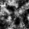
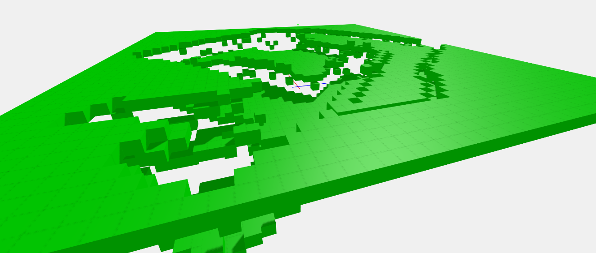

# Interactive 3D Graphics - Progetto

## 28 Ottobre

### Mansi
- Visualizzazione della consegna
- Visualizzazione del codice e piccoli test
- Sperimentazione del codice *heightmap* - implementazione di un primo prototipo di algoritmo di generazione del terreno

    Primo Prototipo
    

    Primo Prototipo (vista Wireframe)
    

    Heightmap usata
    

###
- Refactoring del codice
  - creazioni funzioni per inizializzare camera
  - scena
  - renderer
  - lightsystem

- Commit su GIT

---
## 29 Ottobre

### Mansi
- Ulteriori sperimentazioni con l’algoritmo di generazione del terreno
  - sperimentazione e analisi del primo problema riscontrato: il terreno non risulta uniforme perchè ci sono dei "fori" nei cambi di altezza troppo bruschi, da risolvere

    Esempio problema
  

    Heightmap utilizzata, creata al fine di accentuare il problema riscontrato
  
    

  - Prima sperimentazione che tenta di risolvere il problema, soluzione efficacie ma poco efficiente. Alcuni cubi mancanti vengono inseriti più volte portando ad un overhead nella fase geometry della gpu-pipeline. 

    Esempio del terreno "fixato".
    In giallo i cubi aggiunti successivamente alla prima fase di generazione del terreno
    

  - Seconda Implementazione che risolve senza overhead la problematica dei dislivelli elevati
    

- Pulizia del codice
- Commit su GIT
- Altri problemi riscontrati: pesante impatto sulle performance da parte del sistema di ombre e illuminazione, artefatti grafici sui “bordi dei cubi”. 40-50 fps su una RTX 2070 – i7 9700K.

  esempio di artefatti grafici sui bordi dei cubi
    

---
## 30 Ottobre

### Meeting Gruppo

Progettazione della scena di base e suddivisione dei compiti

Durante i primi giorni di lavoro i compiti sono stati suddivisi in questo modo:
- Relazione: Passabi
- Generazione del terreno: Mansi
- Animazioni, modellazione: Passabi
- LightSystem & Visuals: TODO
- Spawning di oggetti nella scena: TODO

Scena di base (minima da soddisfare i requisiti della consegna)
- Generazione del terreno con:
  - Terreno sui blocchi della superficie;
  - Roccia sui blocchi sottostanti (visibili dall’esterno)
  - Erba, cespugli e alberi posizionati randomicamente sulla superficie:
    - con animazione
    - interattività con la luce (ombre)
  - Edificio in centro alla scena
    - Con animazione 
  - Animazione della telecamera

### Mansi

- Test con heightmap più complessa -> 100x100=10K cubi = 120K triangoli
  - framerate inaccettabile (10-15 su Intel UHD 620); bisogna valutare possibili ottimizzazioni.
  - Usare dei cubi non è per niente efficiente, la maggior parte delle facce sono inutili, sono nascoste e potrebbero benissimo non essere renderizzate al fine di aumentare di molto le performance
    

- Obiettivi del giorno: ottimizzazione della generazione del terreno, lato geometry.
  - Soluzione: inizialmente con una heightmap di 100x100 istanziavamo 10K blocchi nella scena, portando ad un elevato overhead nella gestione di un alto numero di mesh. La soluzione attuata unisce i mesh di tutti i cubi in un unico mesh. Il numero di triangoli non cambia, ma WebGl si trova a lavorare con un unico mesh (frutto del merge degli altri).
  - Possibili problemi: Ora abbiamo un unico mesh, non possiamo applicare materiali diversi… Si possono applicare diverse texture a diverse porzioni del mesh? Da sperimentare e verificare se la soluzione utilizzata è valida.
  - Altre considerazioni: L’implementazione più corretta nella generazione del terreno non dovrebbe utilizzare dei cubi ma delle facce, l’attuale implementazione.

    *Le due immagini riportano le differenze di framerate ottenuto, senza variare il risultato finale:* 
    TEST ESEGUITO SU GPU INTEGRATA INTEL UHD620 (heightmap 100x100):
    

- Settato il renderer in high performance.
- Successive modifiche: I cubi in superficie (erba) vengono mergati in un unico mesh. Allo stesso modo, quelli aggiunti successivamente per coprire i “buchi” vengono mergati in unico mesh “terra”.

  Primi test con le texture del terreno:
  

- Vari test di performance su UHD620, Nvidia 940MX, RTX 2070

### Passabi

- Prime prove con ThreeJS Editor
  - Creazione gruppi (insieme di più forme)
  - Aggiunta colore
  - Aggiunta texture
  - Trasformazioni

- Modellate le pale del mulino
  - Aggiunta texture
  - Aggiunta rotazione
  - Aggiunta ombre
  - Test su starting code with lights

- Modellata l’erba
  - Ho usato 4 piani incrociati
  - Risolto problema trasparenza non completa (usando test z-alpha)
  - Problema ombra da risolvere

- Inizio modellazione struttura del mulino

---
## 31 Ottobre

### Mansi
**Obiettivi del giorno**: refactoring e pulizia del codice; creazione di una piccola roadmap per organizzare il lavoro dei giorni successivi. 
- Ordinamento repository.
- Refactoring codice generazione terreno + commento del codice.
- Fixing normalizzazione dell’altezza (massimo numero di layer voluti)
- Fixed: I cubi vengono ora automaticamente posizionati al giusto offset dal centro della scena in modo tale che il terreno finale sia perfettamente centrato con (0,0,0).
- Fixed: Le texture sui cubi risultavano con i colori sfalsati -> Bisogna settare il material di colore bianco.
- Creazione di una piccola roadmap/lista di obbiettivi/features:

| n° | Features TODO List | Priorita' |
| :---        |    :----:   |          ---: |
| 1 | Ideazione e implementazione di un sistema di spawning randomico della vegetazione nel terreno della scena. Idee: parametro: densità vegetazione. | Alta |
| 2 | Ottimizzazione complessità del terreno (dal punto di vista geometry): Implementare l’approccio con l’uso delle facce e non dei cubi (rimozione dell’overhead di facce non visualizzate e pertanto inutili). | Media |
| 3 | Ristrutturazione del codice, inserimento di variabili (in futuro modificabili via interfaccia) che permettano di configurare con flessibilità i parametri di generazione del terreno. Es: scelta texture_heightmap, n° di layer, texture per i blocchi superficiali e non superficiali, ... | Media |
| 4 | Idea: Aggiunta di un sistema di generazione di superfici d’acqua. | Bassa |
| 5 | Idea: Aggiunta di un piano “infinito” di altezza 0 su cui “appoggia” il terreno. | Bassa |
| 6 | Ottimizzazione velocità di generazione del terreno. *Come?* | Bassa |
| 7 | La telecamera si posiziona automaticamente in una posizione coerente in base alle dimensioni del terreno generato (si adatta alle varie dimensioni). | Bassa |

- Ideazione algoritmo di spawning randomico della vegetazione.

---
## 1 Novembre

### Mansi
**Obiettivi del giorno**: Lavorare sull’implementazione dell’algoritmo di generazione della vegetazione.

- Implementazione dell’algoritmo di spawning randomico di vegetazione nel terreno precedentemente generato. L’algoritmo prende in input un valore “grass_density” che va da 0 a 100, ad esempio: con un valore di 25 vengono scelti randomicamente 25% dei cubi della superficie su cui verrà poi istanziato un modello di vegetazione.
  
  Nell’esempio: Circa 6000 modelli di erba istanziati
  

- Problema riscontrato da fixare: L’algoritmo attualmente importa tramite ObjectLoader il file json (in questo esempio il modello dell’erba) e poi si occupa di istanziarlo nel terreno: Questo causa, come riscontrato precedentemente un overhead nella gestione di un elevato numero di oggetti nella scena, abbattendo il framerate drasticamente (15 FPS su una RTX 2070). Precedentemente, con i cubi del terreno il problema è stato risolto eseguendo il merge dei mesh di ciascun cubo in un'unica entità. È necessario effettuare la stessa operazione con i modelli di vegetazione? Come? Effettuare ricerche.
- Implementazione della feature n° 2 -> Ottimizzazione della complessità del terreno: Implementata la generazione che fa uso di facce e non di cubi. L’overhead di facce istanziate e renderizzate inutilmente è stato rimosso causando un enorme vantaggio in termini di performance. Precedentemente si notavano cali di framerate con terreni da 250x250. Con il nuovo approccio è possibile gestire e visualizzare su schermo terreni generati da immagini superiori a 500x500.

  Heightmap 500x500
  

  Heightmap: 750x750
  Visione wireframe: è possibile notare come non siano più presenti le facce “nascoste” che precedentemente venivano inserite nella scena inutilmente.
  

- Commit su GIT delle modifiche

### Passabi
**Obiettivi del giorno**: finire il modello del mulino, implementazione musica, ricerche sulle GUI, relazione in linguaggio markdown ed eventuali altri modelli

- Refactoring codice
  - si erano create delle inconsistenze sul ramo master di GIT, risolte
  - nuova organizzazione cartelle per evitare che il problema si ripresenti

- Aggiunta musica di sottofondo alla scena
  - per ora, si puo' disattivare premendo "s" (= spegni) e riattivare premendo "m" (= musica)
  - TO DO: implementare queste funzioni con la GUI (priorita' media)

- Scrittura portfolio in linguaggio MarkDown
  - TO DO: finire di inserire le immagini nella directory project_report/img

- Creato modello fungo rosso e grigio + test
  - NB: per le texture abbiamo deciso di usare delle skin gratuite usate per delle mod di MineCraft 
  - TODO: la parte trasparente non dovrebbe fare ombra --> da fixare

- Riscontrato problema sulle pale del mulino
  - Se viene chiamata in Update la rotazione prima che il modello sia caricato al 100% si generano degli errori
  - Risolto con un controllo sul tipo di oggetto prima di effettuare la rotazione

- Completato il modello del mulino
- Commit su Git
  
---
## 2 Novembre

### Mansi
**Obiettivi del giorno**: refactoring, ottimizzazione del codice, ricerche riguardo la gestione di un elevato numero di “oggetti json”.